# :space_invader: Space Invaders :space_invader:  

(/◕ヮ◕)/ *Space Invaders est un jeu de tir spatial en 2D, développé par la société japonaise Taito, sorti en 1978 sur borne d'arcade.  
Un vaisseau qui sait se déplacer dans l'espace et avec ses tirs de missiles il détruit les envahisseurs ! Une vague d'ennemies éliminées, une autre plus fort arrive. Plus on les élimine plus on gagne des points !  
Le jeu ne s'arrête que quand le joueur perd toutes ses points de vie, ceci est donc un jeu à l'infini !* (⊙ˍ⊙)  
 
- [Semaine n°8 : du 18 au 22 mai](#semaine8)
- [Semaine n°7 : du 11 au 15 mai](#semaine7)
- [Semaine n°6 : du 04 au 08 mai](#semaine6)
- [Semaine n°5 : du 27 avril au 1 mai](#semaine5)
- [Semaine n°4 : du 20 au 24 avril](#semaine4)
- [Semaine n°3 : du 13 au 17 avril](#semaine3)
- [Semaine n°2 : du 06 au 10 avril](#semaine2)    
- [Semaine n°1 : du 30 mars au 03 avril](#semaine1)  
- [Glossaire](#glossaire)  

## Semaine n°8 : du 18 au 22 mai 

### Sprints et fonctionnalités réalisées 

#### Fonctionnalité n°5 : Ajouter un envahisseur dans le jeu 

- Story n°1 : Créer un envahisseur à l'initialisation du jeu (pour l'instant le jeu ne comportera qu'un seul envahisseur)  

Positionner un nouveau envahisseur dans l'espace jeu.  
Faire en sorte que la position de l'envahisseur est sur l'ordonnée du vaisseau lors du début du jeu.  
Donner une dimension au envahisseur.

### Fonctionnalité en cours d'implémentation 
Fonctionnalité n°5:  
- Faire en sorte que le jeu gère automatiquement le déplacement automatique de cet envahisseur (uniquement des allers-retours de droite à gauche pour ce sprint)

### Diagramme de classes 
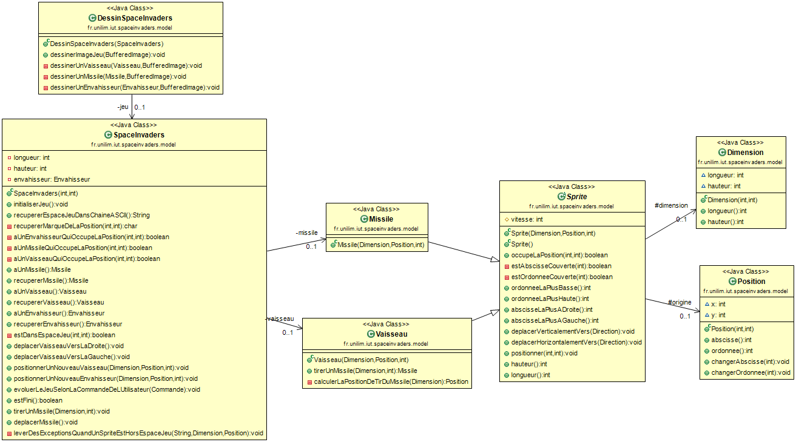

### Nuage de mots du projet spaceinvaders (séance n°7)  
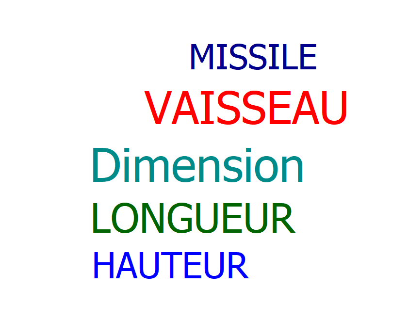

### Difficultés rencontrées 
Aucune

### Remarques diverses
Aucune

-------------
## Semaine n°7 : du 11 au 15 mai 

### Sprints et fonctionnalités réalisées 

#### Fonctionnalité n°4 : Tirer un missile depuis le vaisseau 

- Story n°1 : Quick Design Session - Comprendre ce qu'est un missile et refactorer (diagramme de classe)  

Ajout de classe Sprite comme superclasse de Vaisseau et Missile. 

- Story n°2 : Quick Design Session : Comprendre ce que signifie tirer un missile depuis le vaisseau (diagramme de séquence)  

Positionner un Missile.  
Faire en sorte que le Missile a une longueur et/ou une hauteur plus grande que le Vaisseau (une exception doit être levée).  

- Story n°3 : Paramétrer le moteur graphique et le jeu SpaceInvaders  

Faire en sorte que le vaisseau tire un missile lorsque le joueur appuye sur la barre ESPACE.  
Dessiner le missile.  
Faire en sorte qu'on ne puisse avoir qu'un missile à la fois.    

 - Story n°4 : Faire déplacer le missile à la verticale de manière autonome  

Faire en sorte que le missile doit disparaître du jeu lors qu'il atteint le haut de l'espace jeu.  
Faire déplacer le missile automatiquement (le jeu doit déplacer le missile à chaque unité de temps).  

### Fonctionnalité en cours d'implémentation 
Aucune

### Diagramme de classes 
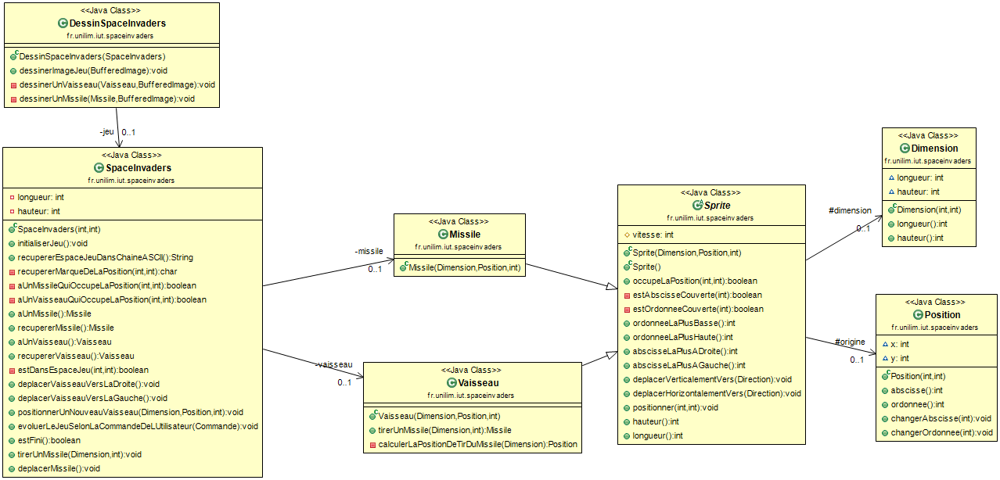

### Nuage de mots du projet spaceinvaders (séance n°7)  
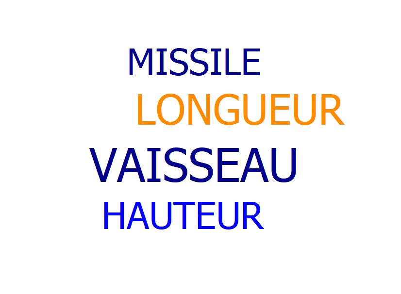

### Difficultés rencontrées 
Tirer un nouveau missile dès que le missile a disparu de l'écran : la position prévue dans la condition, où le missile doit disparaître, n'était pas correcte donc l'affectation null au missile ne fonctionnait pas.

### Remarques diverses
Aucune

-------------
## Semaine n°6 : du 04 au 08 mai 

### Sprints et fonctionnalités réalisées 

#### Fonctionnalité n°4 : Tirer un missile depuis le vaisseau 

- Story n°1 : Quick Design Session - Comprendre ce qu'est un missile et refactorer (diagramme de classe)  

Ajout de classe Sprite comme superclasse de Vaisseau et Missile. 

- Story n°2 : Quick Design Session : Comprendre ce que signifie tirer un missile depuis le vaisseau (diagramme de séquence)  

Positionner un Missile.  
Faire en sorte que le Missile a une longueur et/ou une hauteur plus grande que le Vaisseau (une exception doit être levée). 

### Fonctionnalité en cours d'implémentation 
Fonctionnalité n°4:  
- Paramétrer le moteur graphique et le jeu SpaceInvaders  
- Faire déplacer le missile à la verticale de manière autonome  

### Diagramme de classes 
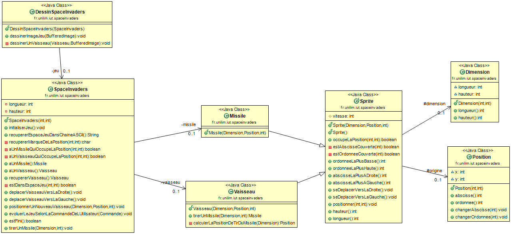

### Nuage de mots du projet spaceinvaders (séance n°6)  
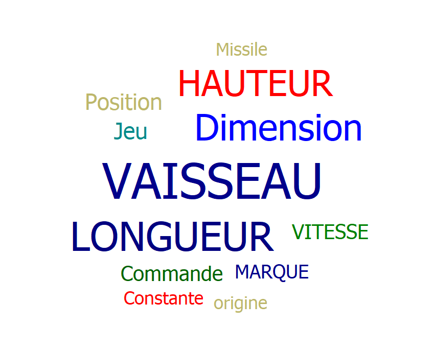

### Difficultés rencontrées 
Aucune

### Remarques diverses
Nouvelles classes : Missile, VaisseauTest, MissileException

-------------
## Semaine n°5 : du 27 avril au 1 mai 

### Sprints et fonctionnalités réalisées 

#### Fonctionnalité n°4 : Tirer un missile depuis le vaisseau 

- Story n°1 : Quick Design Session - Comprendre ce qu'est un missile et refactorer (diagramme de classe)  

Ajout de classe Sprite comme superclasse de Vaisseau et Missile. 

### Fonctionnalité en cours d'implémentation 
Fonctionnalité n°4:  
- Quick Design Session : Comprendre ce que signifie tirer un missile depuis le vaisseau 
- Paramétrer le moteur graphique et le jeu SpaceInvaders  
- Faire déplacer le missile à la verticale de manière autonome   

### Diagramme de classes 
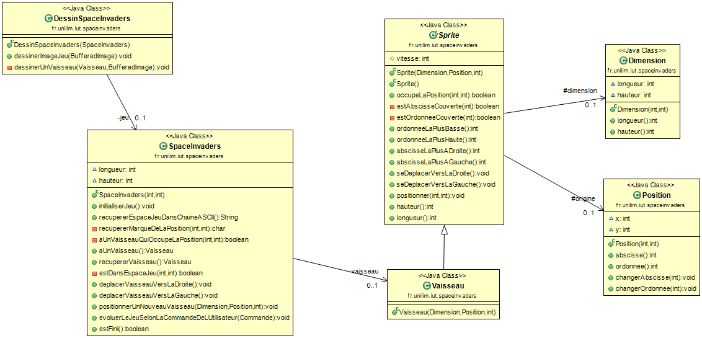

### Nuage de mots du projet spaceinvaders (séance n°5)  
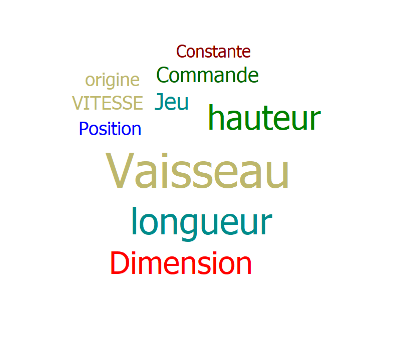

### Difficultés rencontrées 
Aucune

### Remarques diverses
Aucune

-------------

## Semaine n°4 : du 20 au 24 avril 

### Sprints et fonctionnalités réalisées 

#### Fonctionnalité n°2 : Pouvoir dimensionner le vaisseau 

- Story n°3: Déplacer un vaisseau vers la droite en tenant compte de sa dimension  

Déplacer le vaisseau vers la droite en restant dans l'espace de jeu (cas normal).
Immobilisation du vaisseau s'il était déjà à la bordure droite de l'espace de jeu (cas limite).  

- Story n°4: Déplacer un vaisseau vers la gauche en tenant compte de sa dimension  

Déplacer le vaisseau vers la gauche en restant dans l'espace de jeu (cas normal).
Immobilisation du vaisseau s'il était déjà à la bordure gauche de l'espace de jeu (cas limite).

- Story n°5:  Refactorer la classe de test SpaceInvadersTest  

Eliminer Primitive Obsession de la création d'un vaisseau en créant les classes Dimension et Position.  

- Story n°6: Refactorer la classe Vaisseau  

Refactoring dimension et position du vaisseau.  

#### Fonctionnalité n°3 : Choisir la vitesse du vaisseau  

- Story n°1: Ajouter la vitesse au Vaisseau sans régression de comportement  

Ajouter un attribut vitesse au Vaisseau.  

- Story n°2: Régler la vitesse du vaisseau  

Permettre un choix de la valeur de la vitesse.  

- Story n°3: Faire en sorte que le déplacement se fasse correctement pour une vitesse quelconque  

Déplacer le vaisseau vers la droite pour une vitesse quelconque.  
Immobilisation du vaisseau s'il est déjà buté sur la droite de l'espace de jeu.  
Déplacement partiel en vue de place restante avant l'atteinte de la bordure droite de l'espace de jeu.  

Déplacer le vaisseau vers la gauche pour une vitesse quelconque.  
Immobilisation du vaisseau s'il est déjà buté sur la gauche de l'espace de jeu.  
Déplacement partiel en vue de place restante avant l'atteinte de la bordure gauche de l'espace de jeu.  

- Story n°4: Faire avancer le plus vite le vaisseau dans l'application graphique  

Faire en sorte que le moteur graphique fasse bien apparaître un vaisseau avec une vitesse donnée.  
Trouver la bonne valeur pour la vitesse du vaisseau adaptée à notre application. 

#### Space Invaders - Spike : Prise en main et intégration d'un moteur graphique  

Modifier la classe SpaceInvaders pour qu'elle fonctionne comme un Jeu.  
Créer une classe DessinSpaceInvaders permettant de dessiner l'image du jeu.  
Créer une classe Main permettant au MoteurGraphique de lancer le jeu.  
Créer une classe Constante permettant de stocker les valeurs constantes des objets.  
Améliorer l'eXperience Utilisateur (UX).

### Fonctionnalité en cours d'implémentation
Aucune

### Diagramme de classes 
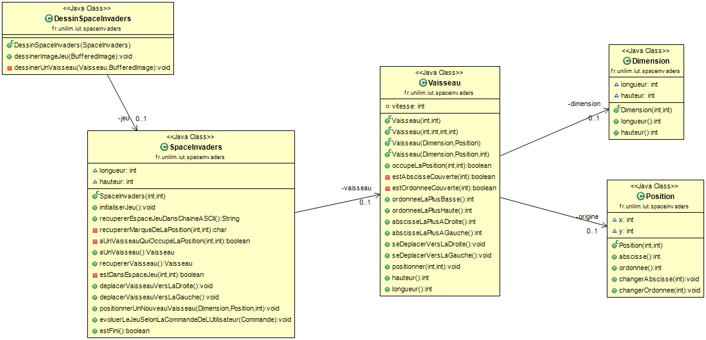

### Nuage de mots du projet spaceinvaders (séance n°4)  
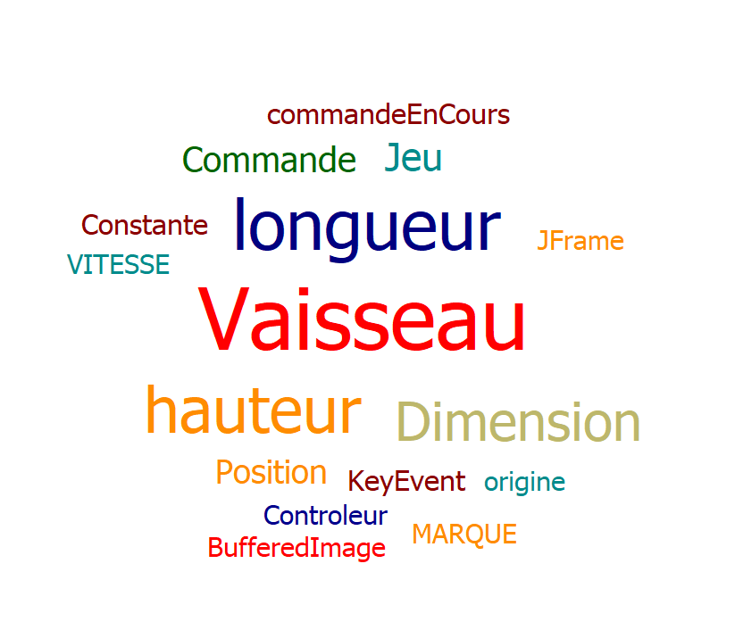

### Difficultés rencontrées 
Aucune

### Remarques diverses  
Le remplacement des primitifs par les objets = "Introduce Parameter Objects".  
Le vaisseau se déplace à droite grâce à la touche flèche droite, ainsi à gauche grâce à la touche flèche gauche.   

## Semaine n°3 : du 13 au 17 avril 

### Sprints et fonctionnalités réalisées 

#### Fonctionnalité n°2 : Pouvoir dimensionner le vaisseau 

- Story n°1 : Positionner un nouveau vaisseau avec une dimension donnée  

Donner une dimensions au vaisseau.
Positionner le vaisseau dimensioné.

- Story n°2 : Faire en sorte qu'il soit impossible de positionner un nouveau vaisseau qui déborde de l'espace de jeu  

Donner une dimension au vaisseau qui dépasse l'espace de jeu. 
Impossible de positionner le vaisseau.

### Fonctionnalité en cours d'implémentation 
Fonctionnalité n°2:   
- Déplacer un vaisseau vers la droite en tenant compte de sa dimension   
- Déplacer un vaisseau vers la gauche en tenant compte de sa dimension  
- Refactorer la classe de test SpaceInvadersTest  
- Refactorer la classe Vaisseau

### Diagramme de classes 
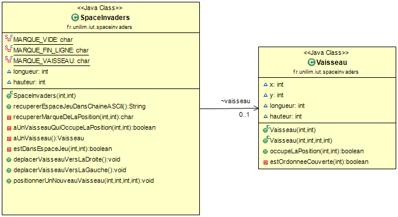

### Nuage de mots du projet spaceinvaders (séance n°3)  
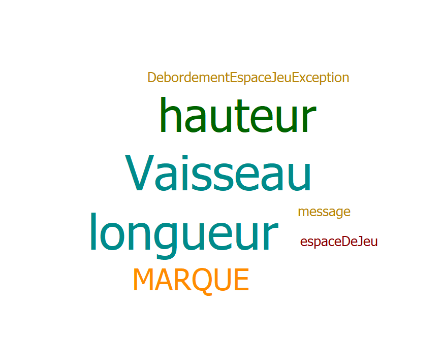

### Difficultés rencontrées 
Aucune

### Remarques diverses
L'ajout de dimension entraîne l'ajout/modification du positionnement du vaisseau.

-------------

## Semaine n°2 : du 06 au 10 avril 

### Sprints et fonctionnalités réalisées 

#### Fonctionnalité n°1 : Déplacer un vaisseau dans l'espace de jeu 

- Story n°2 : Positionner un nouveau vaisseau dans l'espace jeu.

Créer un nouveau vaisseau.  
Positionner le vaisseau créé.

- Story n°3 : Déplacer le vaisseau vers la droite dans l'espace de jeu.  

Déplacer le vaisseau d'un pas vers la droite.  
Immobilisation du vaisseau s'il se trouve sur la bordure droite de l'espace, il doit donc rester à sa position actuelle.  

- Story n°4 : Déplacer le vaisseau vers la gauche dans l'espace de jeu.  

Déplacer le vaisseau d'un pas vers la gauche.  
Immobilisation du vaisseau s'il se trouve sur la bordure gauche de l'espace (rester à sa position actuelle).

### Fonctionnalité en cours d'implémentation 
Aucune

### Diagramme de classes 
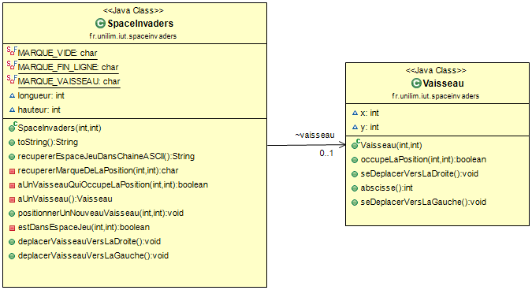

### Nuage de mots du projet spaceinvaders (séance n°2)  
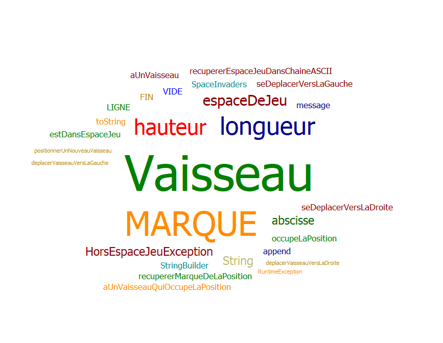

### Difficultés rencontrées 
Aucune

### Remarques diverses

Afin de créer un objet vaisseau, il faut ajouter une classe Vaisseau. 
La présence du vaisseau dans l'espace de jeu est représentée par une marque, ici on a pris 'V'.  

Il n'est encore pas possible de jouer car ce sprint se concentre sur la logique métier et garantit le bon comportement du logiciel.

4 étapes vues pour améliorer la qualité du code :  
- travailler sur la lisibilité du code  
- décomposer le système en petites méthodes  
- isoler les opérations de lecture et d'écriture  
- éliminer les mauvaises odeurs dans le code

-------------

## Semaine n°1 : du 30 mars au 03 avril 

### Sprints et fonctionnalités réalisées 

#### Fonctionnalité n°1 : Déplacer un vaisseau dans l'espace de jeu 

- Story n°1 : Créer un espace de jeu  

Un espace de jeu est créé aux dimensions données (2D). 
Cet espace de jeu est vide.

### Fonctionnalité en cours d’implémentation : 
Fonctionnalité n°1 :  
- Positionner un nouveau vaisseau dans l'espace de jeu.  
- Déplacer le vaisseau vers la droite dans l'espace de jeu.  
- Déplacer le vaisseau vers la gauche dans l'espace de jeu.

### Diagramme de classes 
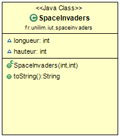

### Nuage de mots du projet spaceinvaders (séance n°1)   
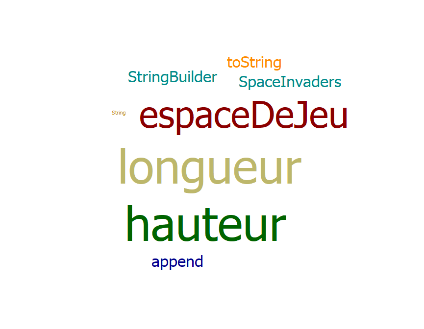

### Difficultés rencontrées 
Un oublie du fonctionnement de git. (・へ・)

### Remarques diverses
 Pour pouvoir mettre en place les tests, il a été nécessaire d’ajouter une fonctionnalité supplémentaire qui permet de représenter l’espace de jeu dans une chaîne ASCII.

-------------

## Glossaire 

* **SpaceInvaders** : espace de jeu où le vaisseau sera créé et dans lequel le vaisseau peut se déplacer.

* **Vaisseau** :  véhicule commandé par le joueur, pouvant se déplacer de droite à gauche et ayant la possibilité de lancer des missiles destinés à détruire le(s) envahisseurs.

* **Envahisseur**  :  ennemi qui apparaît à l'écran, se déplace automatiquement et qui doit être détruit par un missile lancé depuis le vaisseau du joueur.

* **Missile** :  projectile envoyé à la verticale par le vaisseau vers l'envahisseur dans le but de le détruire.  

* **Sprite** : objet ou personnage qui se déplace (ex : Vaisseau, Missile, Envahisseur).  

------------- 
